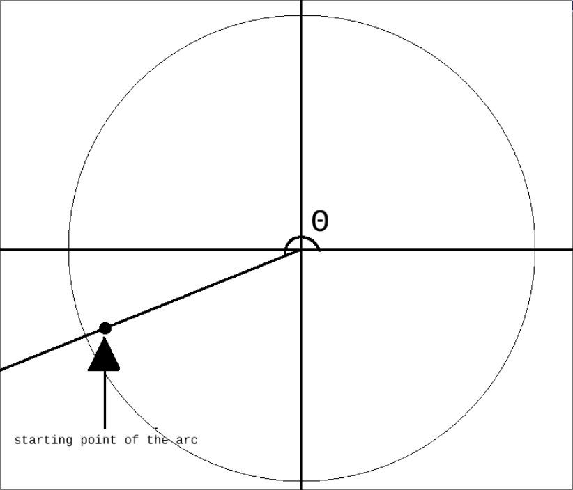
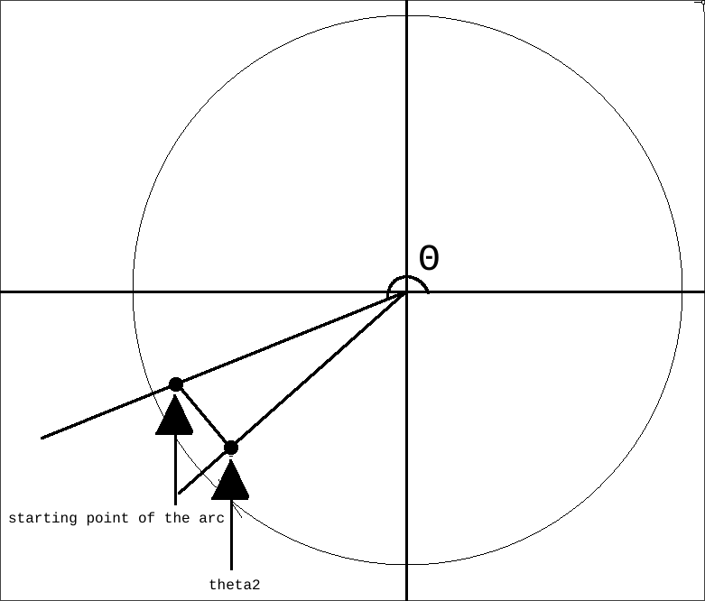

# randomPointInCircle

For the math behind generating a random point that lays within a circle, please refer to [**this**](https://stackoverflow.com/a/50746409/25145880) Stackoverflow post, which is shared under *CC BY-SA 4.0* license.

# SDL_RenderHollowEllipse

Math behind the [code that draws a circle/ellipse](https://stackoverflow.com/a/47766167/25145880).
The original function draws only a quarter of the whole ellipse and then mirrors the quarter to get a full ellipse, "[...] reducing calls to cosf and sinf".

The function uses parametric equations of an ellipse
- $x(\theta) = a \cdot \cos(\theta)$
- $y(\theta) = b \cdot \sin(\theta)$

$a$ is the semi-major axis (x radius).

$b$ is the semi-minor axis (y radius).

$\theta$ is the parameter that varies, typically from $0$ to $2 \pi$ for a full ellipse.

## Drawing
The function draws only a quarter of a full ellipse ($\theta$ goes only from $0$ to $\frac{\pi}{2}$), and mirrors it accross axes to complete an ellipse. As mentioned prior, this is done to reduce the number of calls to `sinf` and `cosf`, this also doesn't sacrifice the overall accuracy of an ellipse.

### For-loop
The variable `theta` (which is our $\theta$ from the formula) is initialized to $0$, and is incremented in steps defined by `step`, which is defined as $\frac{\frac{\pi}{2}}{prec}$, or $\frac{\pi}{2 \cdot prec}$, where $prec$ is the precision of our ellipse.

As the precision value increases, the shape of our ellipse approaches more and more accurate depiction of self. Value of $1$ renders it as a diamond/rhombus, and value of $27$ gives a rather accurate ellipse.


The loop iterates through angles from `step` to $\frac{\pi}{2}$, calculating the $x$ and $y$ coordinates for each angle using the (float) cosine and (float) sine functions.

Since **SDL2_gfx** only works with integer coordinates, we are forced to do so as well.

The $\sin$ and $\cos$ values are going to be floored ($3.98$ becomes $3$) to become integers either way, therefore we don't need extra precision from `double` versions of $\sin$ and $\cos$ functions.

#### Calculating points
The new coordinates ($x_1$, $y_1$) are calculated using this code:
```c
x1 = (float)radiusX * cosf(theta) + 0.5;
y1 = (float)radiusY * sinf(theta) + 0.5;
```

The `+ 0.5` is a simple rounding technique to ensure that any number that is at the very least $0.5$ is rounded to $1$ (refer to how **C** casts between `float` and `int`).

#### Drawing Lines
The function uses `thickLineRGBA` (from **SDL2_gfx**) to draw lines between the calculated points. It draws lines from the previous point to the new point in all four quadrants.

- First  quadrant: $(x_0 + x, y_0 - y)$ to $(x_0 + x_1, y_0 − y_1)$
- Second quadrant: $(x_0 − x, y_0 − y)$ to $(x_0 − x_1, y_0 − y_1)$
- Third  quadrant: $(x_0 − x, y_0 + y)$ to $(x_0 − x_1, y_0 + y_1)$
- Fourth quadrant: $(x_0 + x, y_0 + y)$ to $(x_0 + x_1, y_0 + y_1)$

### Completing the arc
After the loop, there is a check to ensure that the arc is completed correctly. If the last calculated x-coordinate is not zero, it draws the final lines to ensure the ellipse is closed properly.

```c
// arc did not finish because of rounding, so finish the arc
if (x != 0) {
    x = 0;

    thickLineRGBA(r, x0 + x, y0 - y, x0 + x1, y0 - y1, ELLIPSIS_LINE_WIDTH, 0, 0, 0, 255);
    thickLineRGBA(r, x0 - x, y0 - y, x0 - x1, y0 - y1, ELLIPSIS_LINE_WIDTH, 0, 0, 0, 255);
    thickLineRGBA(r, x0 - x, y0 + y, x0 - x1, y0 + y1, ELLIPSIS_LINE_WIDTH, 0, 0, 0, 255);
    thickLineRGBA(r, x0 + x, y0 + y, x0 + x1, y0 + y1, ELLIPSIS_LINE_WIDTH, 0, 0, 0, 255);
}
```

# drawArcBetweenPoints
The function is designed to calculate an arc (the "smile" itself) between two provided points $(x_1, y_1)$ and $(x_2, y_2)$ in 2D space. The arc is drawn with a specified center $(center_x, center_y)$ and a given radius.

## Calculating angles
The $\mathrm{atan2}$ function is used to calculate angle $\theta$ of points $(x_1, y_1)$ and $(x_2, y_2)$ relative to the origin $(0, 0)$. The $\mathrm{atan2}(y, x)$ function computes the angle in radians between the positive x-axis and the point $(x, y)$, taking into account the signs of both arguments to determine the correct quadrant.
```c
float angle1 = atan2(y1, x1); // angle for point (x1, y1)
float angle2 = atan2(y2, x2); // angle for point (x2, y2)
```

## Determining starting and ending angles
We determine which angle $\theta$ is smaller (i.e., which point is "earlier" in the counter-clockwise direction)

Depending on the comparison of `angle1` and `angle2`, we then set `startAngle` and `endAngle` using the $\mathrm{atan2}$ function again, but this time relative to the center of the arc $(center_x, center_y)$. This is done to ensure that the arc is drawn correctly from the starting point to the ending point.
```c
if (angle1 < angle2) {
    startAngle = atan2(y1 - centerY, x1 - centerX); // angle for point (x1, y1)
    endAngle = atan2(y2 - centerY, x2 - centerX);   // angle for point (x2, y2)
} else {
    startAngle = atan2(y2 - centerY, x2 - centerX); // angle for point (x2, y2)
    endAngle = atan2(y1 - centerY, x1 - centerX);   // angle for point (x1, y1)
}
```

## Drawing the arc
Finally, we make a call to a custom function **SDL_RenderArc** to render the arc itself.
```c
// draw the arc
SDL_RenderArc(r, centerX, centerY, radius, startAngle, endAngle);
```

# SDL_RenderArc
The function is drawing the arc that we calculated using **drawArcBetweenPoints** function.

## Prerequisites
Here, like in the **SDL_RenderHollowEllipse**, we also define a precision value `prec` that determines how smooth our arc will be.

We then calculate the step for our upcoming loop, where instead of using $\frac{\pi}{2 \cdot prec}$, we calculate our step as $\frac{\theta_n - \theta_0}{prec}$, where:
- $\theta_n$ is the angle of the arc, between the positive x-axis and the line on which a final point lays (`endAngle`)
- $\theta_0$ is the angle of the arc, between the positive x-axis and the line on which first point lays (`startAngle`)
- $prec$ is the precision of the curve of our arc, the higher - the better the accuracy of the curve.

## For-loop
The loop iterates $prec$ times, to calculate the starting and ending points of each line segment, which will approximate the arc.

### Calculating angles
We calculate the angle $\theta_1$ between the positive x-axis and line on which the starting point of the arc lays, by adding $i \cdot angleStep$ to our initial angle of the arc.

The $i$ is the iterating variable, ranging from $0$ to $prec$ in our For-loop.



```c
float theta1 = startAngle + i * angleStep;
```

After that, we get the subsequent angle $\theta_2$ from our arc, by adding $1$ to the $i$ and then using the same formula as above.

```c
float theta2 = startAngle + (i + 1) * angleStep;
```

Which gives us the subsequent angle in the step for our arc.


Using $\theta_1$ and $\theta_2$ we then calculate the $x$ and $y$ coordinates of the current point $p_i$ of the arc,

As $p_i = radius \cdot (\sin(\theta_1), \cos(\theta_1))$.

Then, we calculate the subsequent point of the arc,

$p_{i+1} = radius \cdot (\sin(\theta_2), \cos(\theta_2))$

#### Cartesian Coordinates
Since SDL2 uses a specific coordinates system, with the origin $(0, 0)$ being in the top-left corner of the window, $+y$ being down and $+x$ being to the right, we need to shift our arc by the coordinates of the centre of the arc, $center_x$ and $center_y$.

```c
int x1 = ((float)centerX + (float)radius * cosf(theta1) + 0.5f);
int y1 = ((float)centerY + (float)radius * sinf(theta1) + 0.5f);
int x2 = ((float)centerX + (float)radius * cosf(theta2) + 0.5f);
int y2 = ((float)centerY + (float)radius * sinf(theta2) + 0.5f);
```

We also add $0.5$ to the results for proper rounding when casting from `float` to `int` (refer to how **C** casts between `float` and `int`).

